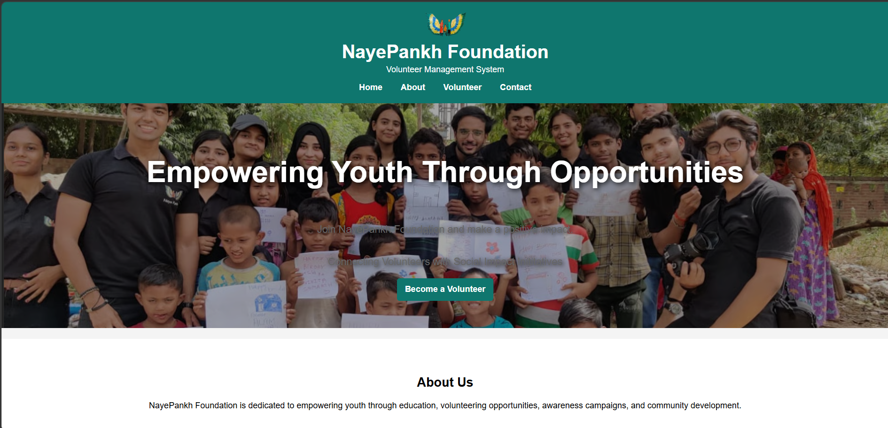
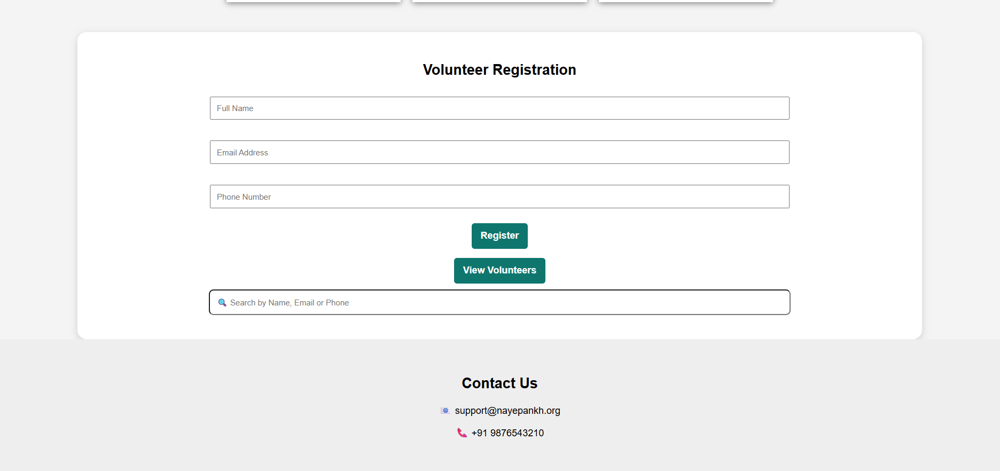

# Volunteer Management System

A Full Stack Volunteer Management System developed for NayePankh Foundation using Spring Boot, MySQL, HTML, CSS, and JavaScript.

## Features

* Volunteer Registration
* View Volunteers
* Search Volunteers
* Update Volunteer Details
* Delete Volunteers
* Toast Notifications
* Responsive User Interface
* REST API Integration
* MySQL Database Connectivity

## Technologies Used

### Frontend

* HTML5
* CSS3
* JavaScript

### Backend

* Java 21
* Spring Boot
* Spring Data JPA

### Database

* MySQL

## Project Structure

```text
FrontEnd/
├── index.html
├── style.css
├── script.js
└── images/

BackEnd/
├── Controller
├── Model
├── Repository
└── Application
```
## Project Screenshots
### Home Page


### Volunteer Registration


![AboutUs}(screenshots/AboutUs.png)

## Future Enhancements

* User Authentication and Authorization
* Volunteer Dashboard
* Event Management Module
* Email Notifications
* Deployment to Cloud Platform

## Author

**Srija Maddu**

Final Year B.Tech (Computer Science)

GitHub: https://github.com/SrijaMaddu
